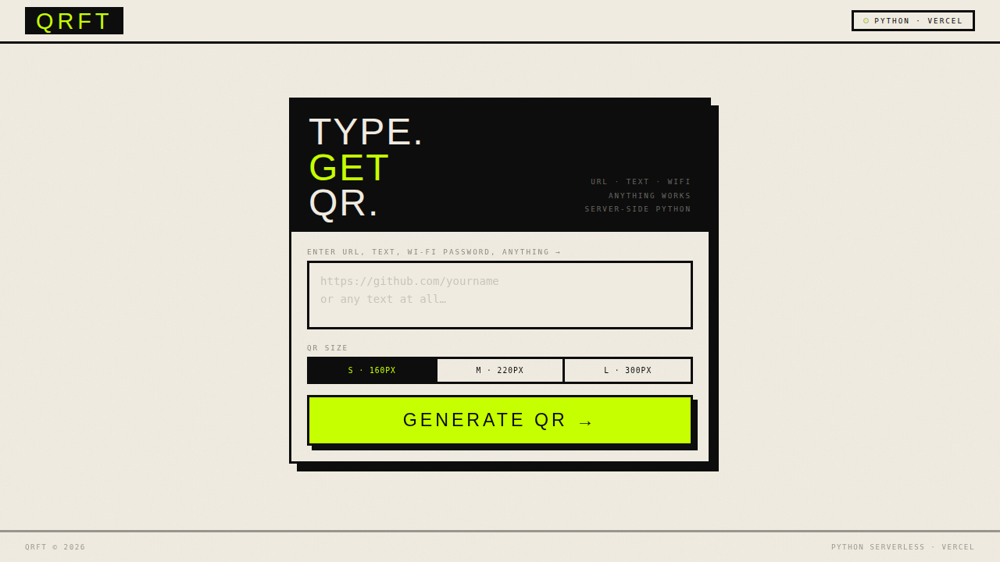
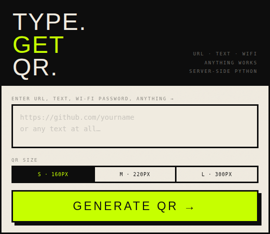
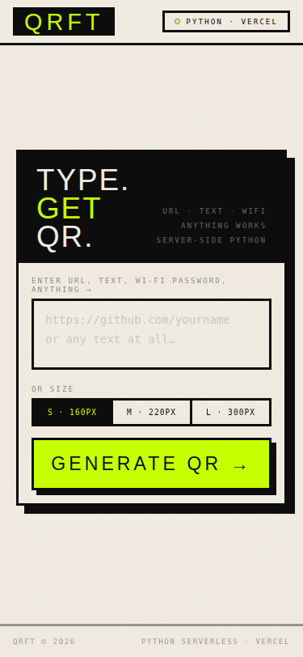

<div align="center">

```
 ██████╗ ██████╗ ███████╗████████╗
██╔═══██╗██╔══██╗██╔════╝╚══██╔══╝
██║   ██║██████╔╝█████╗     ██║   
██║▄▄ ██║██╔══██╗██╔══╝     ██║   
╚██████╔╝██║  ██║██║        ██║   
 ╚══▀▀═╝ ╚═╝  ╚═╝╚═╝        ╚═╝   
```

# ██ QRFT — QR CODE GENERATOR

**`TYPE. GET. QR.`**

> ### 🟢 **LIVE** &nbsp; · &nbsp; PYTHON &nbsp; · &nbsp; SERVERLESS &nbsp; · &nbsp; VERCEL

[](https://python.org)
[](https://vercel.com)
[](LICENSE)

---

<br/>



<br/>

</div>

---

<br/>

> ## ⚡ WHAT IS THIS?
>
> **QRFT** is a _no-nonsense_ QR code generator.
> Paste any text, URL, Wi-Fi password, or literally _anything_ — get a
> clean, scannable QR code **instantly**.
>
> - 🐍 &nbsp; **Python backend** — powered by `qrcode` + `Pillow`
> - ⚡ &nbsp; **Serverless** — deployed as a Vercel function, zero cold starts
> - 🎨 &nbsp; **Neo-brutal UI** — bold, sharp, no fluff
> - 📱 &nbsp; **Fully responsive** — works on every screen size
> - 📋 &nbsp; **Copy or download** — grab the PNG however you want

<br/>

---

<br/>

## 🖥️ UI — DESKTOP

<div align="center">



</div>

<br/>

## 📱 UI — MOBILE

<div align="center">



</div>

<br/>

---

<br/>

> ## 🏗️ HOW IT WORKS
>
> ```
> ┌──────────────┐       ┌─────────────────┐       ┌──────────────┐
> │              │  GET   │                 │  PNG   │              │
> │   BROWSER    │──────▶│  /api/generate   │──────▶│   QR CODE    │
> │              │       │  (Python)        │       │              │
> └──────────────┘       └─────────────────┘       └──────────────┘
>         │                       │
>         │  text=hello           │  qrcode lib
>         │  size=220             │  Pillow resize
>         ▼                       ▼
>     index.html           api/generate.py
> ```

<br/>

---

<br/>

## 📂 PROJECT STRUCTURE

```
QRFT/
├── index.html          ← frontend (single-file, zero deps)
├── api/
│   └── generate.py     ← serverless Python function
├── qr_code.py          ← standalone CLI example (commented)
├── requirements.txt    ← qrcode + Pillow
├── vercel.json         ← routing config
├── youtube_qr.png      ← example output
└── assets/
    ├── qrft-hero.png   ← full UI screenshot
    ├── qrft-card.png   ← card component screenshot
    └── qrft-mobile.png ← mobile view screenshot
```

<br/>

---

<br/>

> ## 🚀 QUICK START
>
> ### Prerequisites
>
> ```
> Python 3.9+
> pip
> Vercel CLI (optional, for deployment)
> ```
>
> ### 1 — Clone
>
> ```bash
> git clone https://github.com/aaadityasngh/Generate-a-QR-Code-with-Python.git
> cd Generate-a-QR-Code-with-Python
> ```
>
> ### 2 — Install dependencies
>
> ```bash
> pip install -r requirements.txt
> ```
>
> ### 3 — Run locally
>
> ```bash
> # Option A: Use Vercel CLI
> vercel dev
>
> # Option B: Just open index.html
> # (API calls won't work without the Python backend)
> ```
>
> ### 4 — Deploy to Vercel
>
> ```bash
> vercel --prod
> ```

<br/>

---

<br/>

## ⚙️ API REFERENCE

```
GET /api/generate
```

| Parameter | Type     | Required | Description                     |
|-----------|----------|----------|---------------------------------|
| `text`    | `string` | **yes**  | Text / URL to encode            |
| `size`    | `int`    | no       | Output size in px (100–400)     |

**Response:** Raw `image/png` bytes

<br/>

> ### 📌 Examples
>
> ```bash
> # Generate a QR for a URL
> curl "https://your-app.vercel.app/api/generate?text=https://github.com&size=300" -o qr.png
>
> # Generate a QR for plain text
> curl "https://your-app.vercel.app/api/generate?text=Hello+World" -o hello.png
> ```

<br/>

> ### ⚠️ Error Responses
>
> | Status | Body                              | Reason                  |
> |--------|-----------------------------------|-------------------------|
> | `400`  | `{"error":"text param is required"}` | Missing `text` param |
> | `400`  | `{"error":"Max 2048 characters"}`   | Input too long          |
> | `500`  | `{"error":"..."}`                   | Server-side failure     |

<br/>

---

<br/>

## 🎯 FEATURES

```
╔══════════════════════════════════════════════════════════╗
║                                                          ║
║  ■ TYPE ANYTHING         URLs, text, Wi-Fi, contacts     ║
║  ■ SIZE PICKER           S (160px) · M (220px) · L (300) ║
║  ■ INSTANT GENERATE      Python does the work server-side║
║  ■ DOWNLOAD PNG          One click, saved to your device ║
║  ■ COPY TO CLIPBOARD     Paste it anywhere               ║
║  ■ HIGH ERROR CORRECTION Scannable even when damaged     ║
║  ■ CORS ENABLED          Use the API from anywhere       ║
║  ■ RESPONSIVE            Desktop, tablet, mobile — all   ║
║                                                          ║
╚══════════════════════════════════════════════════════════╝
```

<br/>

---

<br/>

## 🛠️ TECH STACK

<div align="center">

| Layer       | Tech                                          |
|-------------|-----------------------------------------------|
| **Frontend** | HTML · CSS · Vanilla JS                      |
| **Backend**  | Python 3.9+ · `qrcode` · `Pillow`            |
| **Hosting**  | Vercel Serverless Functions                   |
| **Fonts**    | Bebas Neue · DM Mono (Google Fonts)           |
| **Design**   | Neo-brutalism · Monospace · High contrast     |

</div>

<br/>

---

<br/>

> ## 🤝 CONTRIBUTING
>
> ```
> 1.  Fork the repo
> 2.  Create a feature branch    →  git checkout -b feat/amazing-thing
> 3.  Commit your changes        →  git commit -m "add amazing thing"
> 4.  Push to the branch         →  git push origin feat/amazing-thing
> 5.  Open a Pull Request
> ```
>
> All contributions are welcome — bug fixes, features, docs, everything.

<br/>

---

<br/>

<div align="center">

```
 ████████████████████████████████████
 █                                  █
 █   BUILT WITH PYTHON + VERCEL     █
 █   BY @aaadityasngh               █
 █                                  █
 ████████████████████████████████████
```

**If this helped you, drop a ⭐ on the repo!**

</div>
